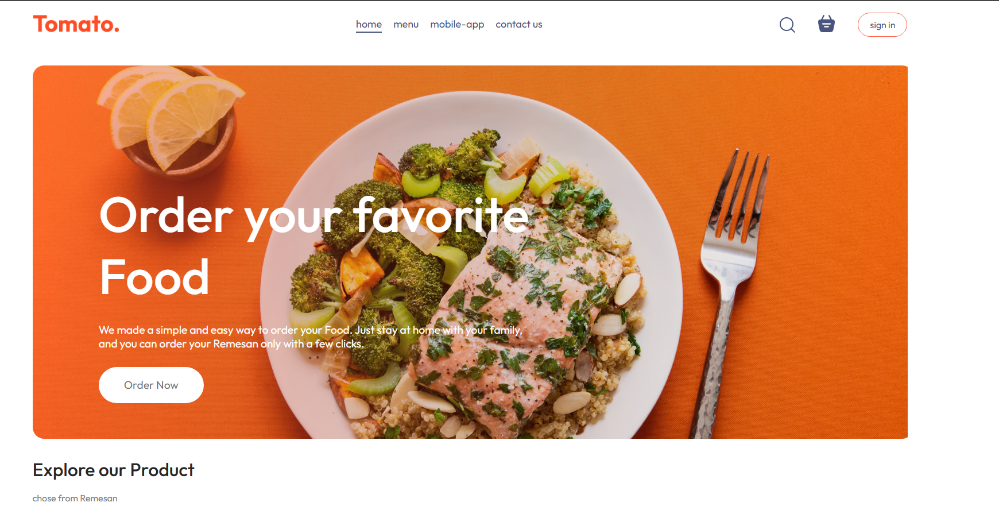
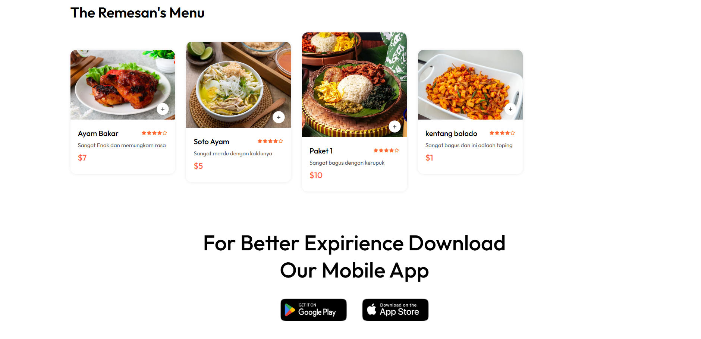
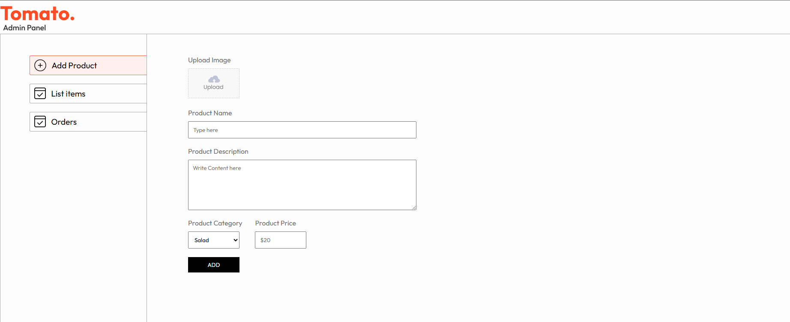
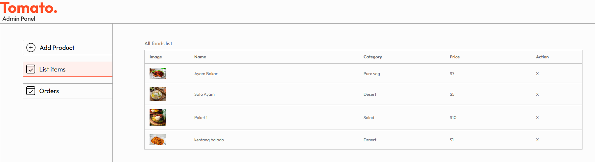

# Project UAS Remesan 🍔

This is a complete food delivery application consisting of three parts:
1. **Backend:** Node.js & Express API connected to MongoDB.
2. **Frontend:** React + Vite customer-facing application.
3. **Admin Panel:** React + Vite dashboard for managing orders/food.

---

## 📋 Prerequisites (Requirements)

Before running this project, you need to install:

* **Node.js & npm:**
    * Download and install from: [nodejs.org](https://nodejs.org/)
    * Check if installed by running: `node -v` and `npm -v` in your terminal.

---

## 🚀 Installation Guide

Since this project is split into folders, you need to set up each one separately.

### 1. Backend Setup (The Server)
The backend manages the database and API.

1.  Open your terminal and move to the backend folder:
    ```bash
    cd backend
    ```
2.  Install the required libraries (Stripe, Mongoose, Express, etc.):
    ```bash
    npm install
    ```
3.  **Important:** Create a `.env` file in the `backend` folder to store your secret keys (since they are not uploaded to GitHub for security). Add the following:
    ```env
    PORT=4000
    MONGO_URI=your_mongodb_connection_string
    STRIPE_SECRET_KEY=your_stripe_secret_key
    JWT_SECRET=your_jwt_secret
    ```
4.  Start the server:
    ```bash
    npm run server
    ```
    *(Keep this terminal open!)*

### 2. Frontend Setup (The User App)
Open a **new** terminal window for the frontend.

1.  Move to the frontend folder:
    ```bash
    cd frontend
    ```
2.  Install React and Vite dependencies:
    ```bash
    npm install
    ```
3.  Start the React app:
    ```bash
    npm run dev
    ```
    *Open the link shown (usually http://localhost:5173) to see the app.*

### 3. Admin Panel Setup
Open a **third** terminal window.

1.  Move to the admin folder:
    ```bash
    cd admin
    ```
2.  Install dependencies:
    ```bash
    npm install
    ```
3.  Start the Admin dashboard:
    ```bash
    npm run dev
    ```

---
## ✨ Project Screenshots

### Customer Dashboard (Frontend)
Here is a look at what the customers see when ordering food:


<br>


### Admin Panel
Here is the interface for restaurant owners to manage orders and food items:


<br>

## 🛠️ Built With

* **Frontend & Admin:** React, Vite, CSS
* **Backend:** Node.js, Express.js
* **Database:** MongoDB
* **Payments:** Stripe
